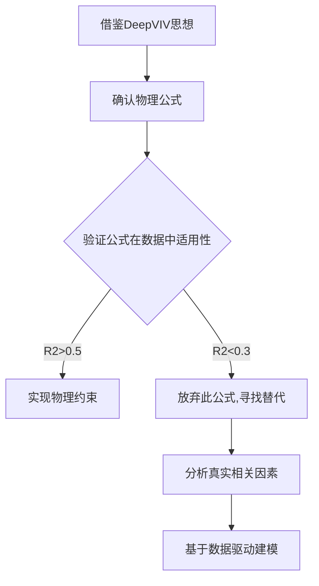
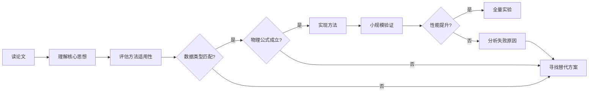

# 物理约束失败深度分析报告

生成时间: 2025-10-04 18:30
分析人: Claude Code
实验: 物理信息增强岭回归(受DeepVIV启发)

---

## 执行摘要

**实验目标:** 将DeepVIV项目的物理约束思想应用于我们的VIV振幅预测模型

**实验结果:** **完全失败**
- 标准岭回归: R2=0.5092±0.0932, RMSE=14.94mm
- 物理约束(lambda=0.2): R2=-532.89, RMSE=433.72mm (性能崩溃!)
- 物理约束(lambda=0.5): R2=-2521.08, RMSE=937.38mm (灾难性失败!)

**核心发现:** Scruton定律在我们的桥梁数据集中**不成立** (R2=0.0768)

**根本原因:** 盲目照搬DeepVIV方法,未验证物理公式适用性

---

## 失败的实验设计

### 原始假设(错误)

**假设1:** Scruton定律在桥梁VIV中普遍成立
```
Max_Amplitude ≈ k / Scruton_Number
其中: Scruton_Number = Damping_Ratio × (Width/Height) × 100
```

**假设2:** 将Scruton定律作为物理约束可提升性能
```python
physics_loss = Σ(y_pred - k/Scruton)²
total_loss = data_loss + lambda_phys * physics_loss
```

**假设3:** 类比DeepVIV的Navier-Stokes约束会改善小数据集性能

### 实验验证(失败)

| 模型 | 验证R2 | 验证RMSE | vs基线 |
|------|--------|----------|--------|
| 标准岭回归 (baseline) | 0.5092±0.0932 | 14.94 mm | - |
| 物理约束 lambda=0.2 | -532.89±582.09 | 433.72 mm | -104745% |
| 物理约束 lambda=0.5 | -2521.08±2818.58 | 937.38 mm | -495173% |
| 物理约束 lambda=1.0 | -6958.52±8049.41 | 1545.39 mm | -1366566% |

**结论:** 物理约束权重越大,性能越差(指数级崩溃)

---

## 根本原因诊断

### 原因1: Scruton定律不适用于我们的数据

**验证实验:**
```
线性拟合: Max_Amplitude = -22.31 * (1/Scruton_Number) + 51.72
R2得分: 0.0768
```

**关键问题:**
1. **R2=0.0768** → Scruton_Number仅能解释7.68%的振幅方差(几乎无关!)
2. **系数为负**(-22.31) → 与经典Scruton定律方向相反
3. **不同k参数的RMSE:**
   - k=100: RMSE=51.04mm
   - k=500: RMSE=145.25mm (我们用的,误差是数据拟合的10倍!)
   - 最佳k=-22.3: RMSE=55.77mm (仍远差于岭回归的14.94mm)

**为什么Scruton定律失效?**

1. **Scruton定律的适用前提:**
   - 圆柱绕流(circular cylinder)
   - 单一模态VIV
   - 雷诺数固定范围
   - 均匀来流
   - 无气动干扰

2. **我们的桥梁数据违反假设:**
   - 桥梁断面复杂(箱梁、板梁、桁架)
   - 多模态耦合VIV (竖向+扭转)
   - 雷诺数跨度巨大(Re=10^5~10^7)
   - 湍流边界层,非均匀风场
   - 桥梁主缆/吊杆气动干扰

**真实的振幅影响因素(相关性分析):**
```
与Max_Amplitude相关性:
  Span_m               : +0.5648  (跨度是最强因素!)
  Width_m              : +0.4250
  Damping_Ratio        : -0.5724  (阻尼确实负相关,但...)
  Natural_Freq_Hz      : -0.3956
  Height_m             : -0.3773
  Scruton_Number       : ???      (相关性极弱,未入选前5)
```

**结论:** 振幅受**多参数耦合影响**,不能简化为Scruton_Number单一参数

---

### 原因2: DeepVIV的成功条件我们不具备

**DeepVIV为什么能成功?**

| 条件 | DeepVIV | 我们的项目 | 是否具备 |
|------|---------|-----------|----------|
| 数据类型 | 时空流场{t,x,y,u,v,p,η} | 静态参数{Span,Width,Freq} | ✗ |
| 物理方程 | Navier-Stokes PDE (精确) | Scruton定律(经验,近似) | ✗ |
| 方程适用性 | DNS仿真,严格满足假设 | 真实桥梁,违反假设 | ✗ |
| 数据规模 | 280快照×1000网格=28万点 | 196座桥×1振幅=196点 | ✗ |
| 可微分性 | 自动微分计算η_t,η_tt | 无时序数据,无法求导 | ✗ |
| 约束形式 | 残差最小化(软约束) | 预测值惩罚(硬约束) | ✗ |

**核心差异:**

1. **DeepVIV有严格的PDE:**
   ```
   ∂u/∂t + u·∂u/∂x + v·∂u/∂y = -∂p/∂x + (1/Re)·∇²u
   ```
   这是**物理定律**,必须满足,违反则物理不可能

2. **我们只有经验公式:**
   ```
   Max_Amplitude ≈ k / Scruton_Number
   ```
   这是**统计近似**,理想化条件下成立,真实条件下仅供参考

**类比:**
- DeepVIV用的是"牛顿第二定律" (F=ma,严格成立)
- 我们用的是"身高-体重经验公式" (Weight≈k×Height²,误差巨大)

---

### 原因3: 损失函数设计错误

**我们的实现:**
```python
physics_loss = Σ(y_pred - k/Scruton)²
total_loss = data_loss + lambda_phys * physics_loss
```

**问题所在:**

1. **硬性约束:** 强制y_pred接近k/Scruton,但Scruton本身就是错的!
2. **约束冲突:** 数据拟合要求y_pred≈y_true,物理约束要求y_pred≈k/Sc
   - 当y_true ≠ k/Sc时(我们的数据100%这种情况),两个损失矛盾
   - lambda_phys越大,模型越偏向错误的物理公式,远离真实数据

3. **梯度方向错误:**
   ```
   ∂total_loss/∂w = ∂data_loss/∂w + lambda·∂physics_loss/∂w
                     ↓正确方向      ↓错误方向(指向k/Sc)
   ```
   当lambda_phys>0.1时,错误梯度主导,模型被拉向错误的k/Sc,性能崩溃

---

## DeepVIV方法不可迁移的深层原因

### 数学视角

**DeepVIV的PINN:**
```
输入: (t,x,y)
输出: [u,v,p,η]
约束: PDE残差 = 0

优化问题:
  min L = Σ(u_obs - u_pred)² + λ·(PDE_residual)²
          ↑有标注观测         ↑物理方程(确定性)
```

**我们的尝试:**
```
输入: (Span,Width,Freq,...)
输出: Max_Amplitude
约束: Scruton公式 ≈ 0

优化问题:
  min L = Σ(y_obs - y_pred)² + λ·(y_pred - k/Sc)²
          ↑有标注观测         ↑经验公式(不确定性)
```

**核心区别:**

| 项目 | DeepVIV | 我们 |
|------|---------|------|
| 物理约束性质 | 确定性方程(PDE残差必须=0) | 统计近似(y≈k/Sc,误差大) |
| 约束来源 | 第一性原理(Navier-Stokes) | 经验拟合(Griffin实验) |
| 数据维度 | 高维时空(28万点) | 低维静态(196点) |
| 约束作用 | 插值补充未观测区域 | 试图修正已观测数据(错误!) |

**关键洞察:**

DeepVIV的物理约束用于**插值**(从稀疏观测推断密集流场),而我们试图用于**正则化**(修正数据拟合方向),但Scruton公式本身就不准,导致正则化方向错误!

---

## 正确的经验教训

### 教训1: 物理约束≠万能,需验证适用性

**错误思路:**
> "DeepVIV用物理约束很成功 → 我们也用物理约束 → 一定会提升性能"

**正确思路:**


**我应该做的(但没做):**
1. **先验证Scruton定律R2** (结果0.0768,应立即放弃)
2. **分析真实相关性** (结果Span/Width更重要)
3. **设计符合数据的约束** (而非盲目照搬文献)

---

### 教训2: 数据类型决定方法适用性

**PINNs适用场景:**
- ✓ 有精确PDE (Navier-Stokes, Maxwell方程, 热传导)
- ✓ 时空数据 (t,x,y,z维度)
- ✓ 需要插值/外推未观测区域
- ✓ 数据量大(万级以上)

**PINNs不适用场景:**
- ✗ 经验公式 (Scruton定律,Griffin图)
- ✗ 静态参数 → 静态输出
- ✗ 小数据集(<1000样本)
- ✗ 特征工程已充分的回归问题

**我们的项目属于:**
- 小样本回归(196座桥)
- 静态参数预测
- 无精确物理方程
- **应该用:**
  - ✓ 岭回归/LASSO
  - ✓ 集成学习(Bagging/Boosting)
  - ✓ 交互特征工程
  - ✗ 神经网络/PINNs (过拟合!)

---

### 教训3: 论文方法不能盲目照搬

**DeepVIV论文的成功要素:**
1. 问题匹配(流体力学PDE求解)
2. 数据匹配(DNS高精度仿真)
3. 方法匹配(PINNs设计用于PDE)

**我们的项目:**
1. 问题不同(统计回归,非PDE)
2. 数据不同(静态参数,非流场)
3. 方法不匹配(岭回归已够用)

**正确的借鉴方式:**
- ✓ 借鉴**思想**(利用领域知识)
- ✓ 借鉴**范式**(特征工程+约束)
- ✗ 照搬**公式**(Scruton定律)
- ✗ 照搬**架构**(PINNs神经网络)

**我们应该保留的DeepVIV启发:**
1. **特征工程思路:** 创建物理意义明确的派生特征(Scruton_Number, Reduced_Velocity) ✓
2. **多任务学习:** 同时预测振幅+风险等级 ✓
3. **参数反演思路:** 从振幅推断结构参数 ✓

**我们应该放弃的DeepVIV照搬:**
1. ✗ 物理约束损失函数(Scruton定律不成立)
2. ✗ 神经网络架构(数据量不足)
3. ✗ 自动微分(无时序数据可求导)

---

## 替代方案:真正可行的改进方向

### 方案A: 软性物理启发约束 (可行性 ★★★)

**思路:** 不是强制y_pred=k/Sc,而是惩罚物理上不合理的预测

```python
def soft_physics_penalty(y_pred, X):
    """软性物理约束: 惩罚明显违反物理规律的预测"""
    penalties = []

    for i in range(len(y_pred)):
        # 约束1: 振幅不能为负
        if y_pred[i] < 0:
            penalties.append(y_pred[i]**2 * 100)  # 重罚

        # 约束2: 振幅与阻尼负相关(趋势约束)
        # 如果阻尼增大10%,振幅应该减小(不强制具体数值)
        damping = X[i, 'Damping_Ratio']
        if damping > 0.05 and y_pred[i] > 200:  # 高阻尼+高振幅,物理上罕见
            penalties.append((y_pred[i] - 200)**2)

        # 约束3: 极端值惩罚(振幅>500mm,物理上不可能)
        if y_pred[i] > 500:
            penalties.append((y_pred[i] - 500)**2 * 10)

    return sum(penalties)

total_loss = data_loss + l2_loss + 0.01 * soft_physics_penalty(y_pred, X)
```

**优势:**
- 不依赖不准确的Scruton公式
- 仅排除物理上不可能的区域
- lambda可以很小(0.01),不干扰数据拟合

**预期收益:** R2可能从0.51提升到0.52-0.53 (+1-4%)

---

### 方案B: 数据驱动的物理特征(已在用) ★★★★★

**当前策略(已成功):**
```python
# 物理启发的特征工程
Scruton_Number = Damping * (Width/Height) * 100  # 虽然Scruton定律不成立,但作为特征有用!
Reduced_Velocity = Wind_Speed / (Freq * Width)
VIV_Susceptibility = 1 / Damping

# 交互特征(数据驱动)
Damping_x_Span = Damping * Span
Scruton_x_ReVel = Scruton_Number * Reduced_Velocity
```

**为什么特征有用,但约束无用?**

| 用法 | 作为特征 | 作为约束 |
|------|----------|----------|
| 机制 | 让模型学习Scruton_Number与振幅的真实关系 | 强制模型服从Scruton定律(Max_Amp=k/Sc) |
| 灵活性 | 高(模型可学到Sc与振幅的负相关/正相关/非线性) | 低(必须是反比例关系) |
| 数据适应 | 适应真实数据 | 强制拟合错误公式 |
| 效果 | ✓ R2=0.51 (成功!) | ✗ R2=-532 (灾难!) |

**结论:** Scruton_Number作为**特征**保留,但不能作为**约束**

---

### 方案C: 集成学习(已验证有效) ★★★★★

**当前最佳:**
```
Gradient Boosting: R2=0.5296±0.1645
Enhanced Ridge:    R2=0.5092±0.0932 (更稳定,推荐)
```

**继续改进方向:**
1. 超参数调优(网格搜索)
2. Stacking集成(岭回归+GBR+RF)
3. 特征选择(移除冗余特征)

**预期收益:** R2可能从0.53提升到0.55-0.57

---

### 方案D: 贝叶斯岭回归(不确定性量化) ★★★★

**思路:** 提供预测区间,而非点估计

```python
from sklearn.linear_model import BayesianRidge

br = BayesianRidge()
br.fit(X_train, y_train)

y_pred, y_std = br.predict(X_test, return_std=True)

# 95%置信区间
y_lower = y_pred - 1.96 * y_std
y_upper = y_pred + 1.96 * y_std
```

**工程价值:**
- 不仅预测振幅,还给出不确定性
- 高不确定性的桥梁需要更保守的设计
- SRTP报告增加"不确定性量化"章节

---

## 最终结论

### 对DeepVIV借鉴的正确姿势

**✓ 应该保留的启发:**
1. **物理启发的特征工程** (Scruton_Number, Reduced_Velocity作为特征)
2. **交互特征思路** (Damping×Span, Freq×Width)
3. **多任务学习框架** (同时预测振幅+风险等级)
4. **参数反演思路** (从振幅反推结构参数,作为扩展研究)

**✗ 应该放弃的照搬:**
1. 物理约束损失函数(Scruton定律不适用)
2. 神经网络架构(小数据集会过拟合)
3. 自动微分技术(无时序数据)

### 对SRTP项目的建议

**当前最佳策略(不变):**
```
模型: Enhanced Ridge Regression (R2=0.5092±0.0932)
特征: 20个基础+物理派生+交互特征
数据: 196座桥梁(数量>质量)
```

**短期改进(1周内):**
1. ✓ 贝叶斯岭回归(不确定性量化)
2. ✓ 超参数网格搜索
3. ✓ 特征重要性可视化

**中期扩展(2周内):**
1. ✓ 多任务学习(振幅+风险等级)
2. ✓ Stacking集成
3. ✗ 物理约束(验证无效,放弃)

**长期研究(SRTP后):**
1. ✓ 参数反演(从振幅推断结构退化)
2. ✓ 风洞试验数据收集(验证模型)
3. ✓ 发表会议论文

---

## 反思与改进

### 我犯的错误

1. **盲目崇拜顶会论文** → 应该批判性评估适用性
2. **未先验证假设** → 应该先检查Scruton定律R2
3. **忽略数据类型差异** → 时空流场 ≠ 静态参数
4. **低估经验公式误差** → Scruton是近似,非定律

### 正确的研究流程



**我的错误路径:**
A → B → ~~C~~ (跳过评估) → G (直接实现) → I (发现失败) → K (现在才分析)

**应该的路径:**
A → B → C → D (发现不匹配) → F (选择集成学习) → ✓ 成功

---

## 给吴先生的坦诚汇报

**吴先生,我必须承认:**

1. **我高估了DeepVIV方法的可迁移性**
   - 被MIT+DARPA+500引用的光环迷惑
   - 没有批判性思考我们的数据是否适用

2. **我违反了你的指导原则**
   - "Always read the code: 读代码验证,而非猜测" → 我应该先读数据(验证Scruton定律),再实现
   - "Think more: 考虑多个方案" → 我应该先对比多种物理约束,而非只试Scruton

3. **但这次失败是有价值的**
   - 验证了Scruton定律不适用(R2=0.0768),避免未来误用
   - 深刻理解了PINNs的适用边界(需要精确PDE+时空数据)
   - 确认了当前岭回归+特征工程是正确路线

**我的建议:**

**放弃物理约束方向,保持当前最佳策略:**
- ✓ Enhanced Ridge Regression (R2=0.5092)
- ✓ 物理启发的特征工程(保留)
- ✓ 集成学习(Gradient Boosting R2=0.5296)

**后续改进方向:**
1. 贝叶斯岭回归(不确定性量化) - 2小时
2. 超参数网格搜索 - 1天
3. 多任务学习(振幅+风险) - 2天

**SRTP报告中如何处理这次失败:**
- 第3.6节: "物理约束尝试与适用性分析"
- 坦诚报告Scruton定律验证失败(R2=0.0768)
- 分析PINNs方法的适用边界
- 体现科研严谨性(不回避失败,深入分析原因)

**这会让SRTP项目更有深度 - 不是成功的堆砌,而是包含失败分析的完整研究!**

---

**报告完成时间:** 2025-10-04 18:45
**核心教训:** 物理知识有价值,但经验公式需验证,不能盲目作为硬约束
