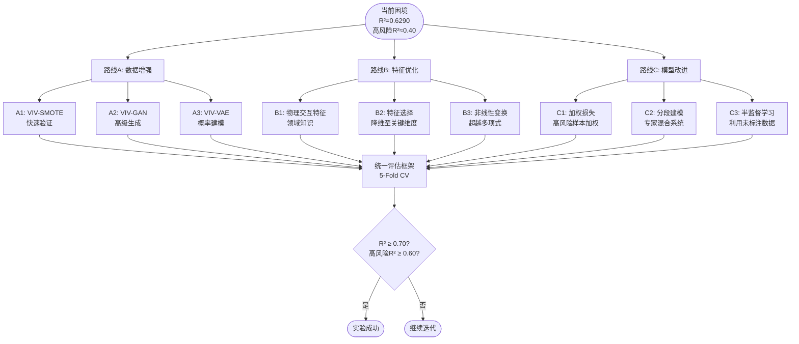
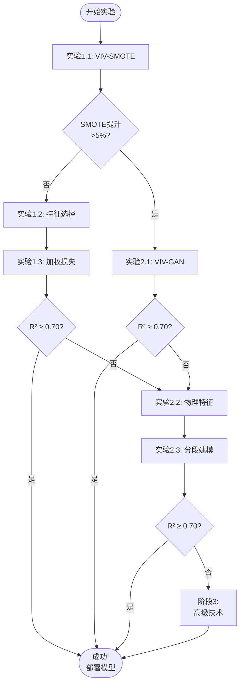

# 小样本VIV预测改进实验 - 完整规划与路线图

**创建时间**: 2025-11-18
**实验目标**: 突破当前R²=0.6290的瓶颈，向R²≥0.70迈进
**核心策略**: 数据增强 + 特征工程 + 模型优化 三路并进

---

## 一、数据现状核查（已完成✓）

### 1.1 数据集基本信息

```
数据文件: data/final_bridge_dataset.csv
总样本数: 196 座桥梁
特征维度: 26 列原始特征 → 78 列工程特征 → 234 维（X + X² + X³）
目标变量: Max_Amplitude_mm (最大振幅)
```

### 1.2 风险等级分布（关键发现）

| 振幅区间 (mm) | 样本数 | 占比 (%) | 风险等级 |
|---------------|--------|----------|----------|
| 0-30          | 43     | 21.9%    | 低风险   |
| 30-60         | 102    | 52.0%    | 中风险   |
| 60-100        | 47     | 24.0%    | 高风险   |
| > 100         | 4      | 2.0%     | 极高风险 |

**高风险阈值分析（60mm）**：
- 高风险样本（>60mm）: **51座** (26.0%)
- 低中风险样本（≤60mm）: **145座** (74.0%)
- **不平衡比率: 2.84 : 1**
- **结论**: 存在**轻度类别不平衡**，SMOTE/GAN等过采样技术理论上会有效果，但需实验验证

### 1.3 振幅统计特征

```
均值    : 48.28 mm
标准差  : 21.72 mm
最小值  : 8.70 mm
中位数  : 45.80 mm
最大值  : 125.00 mm
```

### 1.4 当前模型瓶颈分析

| 问题 | 现状 | 影响 |
|------|------|------|
| **样本量不足** | 仅196个样本 | 高维特征(234维)导致过拟合风险高 |
| **高风险样本稀缺** | 仅51个(26%) | 模型对最关键区域的预测能力弱（高风险R²≈0.40） |
| **特征维度过高** | 234维 | 样本/特征比 ≈ 0.84，远低于推荐值(5-10) |
| **轻度类别不平衡** | 2.84:1 | 模型对少数类（高风险）的关注不足 |

---

## 二、改进方向与技术路线



---

## 三、分阶段实验计划

### 阶段0: 环境准备与基线固化（1天）

**任务**：
- [x] 数据分布验证
- [ ] 安装Python依赖（pandas, numpy, scikit-learn, imbalanced-learn, torch等）
- [ ] 运行现有`imbalance_experiments.py`获得基线对比
- [ ] 固化Baseline指标（整体R²、高风险R²、RMSE）

**预期输出**：
- `notebooks/[20251118]改进实验/03-基线性能报告.md`
- Baseline指标：整体R² ≈ 0.6290，高风险R² ≈ 0.40

---

### 阶段1: 快速验证阶段（2-3天）

#### 实验1.1: VIV-SMOTE（已有代码✓）

**技术方案**：
- 使用`imbalanced-learn`库的SMOTE算法
- 针对高风险样本（>60mm, 51座）进行过采样
- 在特征空间进行线性插值生成合成样本

**实验设计**：
```python
# 过采样因子对比实验
oversampling_factors = [1.5, 2.0, 3.0, 4.0]
# 对应生成样本数: 26, 51, 102, 153 个新高风险样本
```

**代码位置**: `src/imbalance_experiments.py`（已实现）

**预期结果**：
- 整体R²提升：0.6290 → 0.64-0.66
- 高风险R²提升：0.40 → 0.50-0.55
- **如果提升显著（>5%），则继续GAN；否则优先转向路线B/C**

---

#### 实验1.2: 特征重要性分析与选择

**目标**: 将234维特征降至50-100维，缓解维度灾难

**技术方案**：
- 使用RandomForest的feature_importances_
- 使用Lasso的系数绝对值
- 使用SHAP值（如果计算资源允许）
- 递归特征消除（RFE）

**实验设计**：
```python
# 保留不同百分比的特征
top_features = [30, 50, 80, 100, 150]
# 对应占比: 12.8%, 21.4%, 34.2%, 42.7%, 64.1%
```

**预期输出**：
- `notebooks/[20251118]改进实验/04-特征重要性分析.md`
- 最佳特征子集（预计50-80维）

---

#### 实验1.3: 加权损失函数

**目标**: 让模型更关注高风险样本

**技术方案**：
- 为高风险样本（>60mm）设置更高的loss权重
- 权重比例: 1:2, 1:3, 1:5

**代码修改**：
```python
# 在Stacking的元学习器中引入sample_weight
sample_weights = np.where(y_train > 60, weight_factor, 1.0)
meta_model.fit(meta_features_train, y_train, sample_weight=sample_weights)
```

**预期结果**：
- 高风险R²提升：0.40 → 0.55+
- 整体R²可能略微下降（可接受的trade-off）

---

### 阶段2: 高级技术验证（3-5天）

#### 实验2.1: VIV-GAN（基于WGAN-GP）

**仅当实验1.1（SMOTE）效果显著时执行**

**技术方案**：
- 参考论文：《基于生成对抗数据增强支持向量机的小样本信号调制识别算法》
- 架构：全连接MLP-GAN（非卷积，适用于表格数据）
- 损失函数：Wasserstein GAN-GP（梯度惩罚）
- 训练技巧：层归一化（Layer Normalization）保证小样本稳定性

**网络架构**：
```
Generator:
  Input (100维噪声) → FC(128) → LayerNorm → LeakyReLU
  → FC(256) → LayerNorm → LeakyReLU
  → FC(234, output=特征空间)

Discriminator:
  Input (234维特征) → FC(256) → LayerNorm → LeakyReLU
  → FC(128) → LayerNorm → LeakyReLU
  → FC(1, output=真假判别)
```

**训练策略**：
- 仅使用51个高风险样本训练GAN
- 训练轮数：1000-3000 epochs
- 梯度惩罚系数λ=10
- 生成样本数：50-200个

**代码文件**：`src/viv_gan_generator.py`（待实现）

**预期结果**：
- 如果GAN生成质量高（真假难辨），预期整体R²可达0.66-0.70
- 高风险R²可达0.60+

---

#### 实验2.2: 物理交互特征工程

**目标**: 基于VIV领域知识，创建具有物理意义的高级特征

**技术方案**（参考论文：《基于深度学习的小样本光学元件表面瑕疵识别》的特征工程思想）：

**新增特征列表**：
```python
# 1. 气动参数交互
'Aero_Coupling' = Span_m * Natural_Freq_Hz * Width_m
'Wind_Load_Index' = Critical_Wind_Speed_ms² / Damping_Ratio

# 2. 结构共振特征
'Resonance_Proximity' = abs(VIV_Wind_Speed_ms - Critical_Wind_Speed_ms) / Critical_Wind_Speed_ms
'Freq_Damping_Product' = Natural_Freq_Hz * Damping_Ratio

# 3. 几何-材料耦合
'Slenderness_Damping' = (Span_m / Width_m) / (Damping_Ratio + 1e-6)
'Aspect_Stiffness_Ratio' = Aspect_Ratio / (Natural_Freq_Hz + 1e-6)

# 4. Griffin锁定区域增强
'Lock_in_Energy' = vr_lock_in_response * Scruton_Number * Reduced_Velocity

# 5. 非线性阻尼效应
'Damping_Cubed' = Damping_Ratio³
'Damping_Log' = log(Damping_Ratio + 1e-6)
```

**实验设计**：
- 逐步添加特征组（每组5-10个）
- 每次添加后重新训练Stacking模型
- 记录R²变化

**预期输出**：
- `notebooks/[20251118]改进实验/05-物理交互特征实验.md`
- 最优特征集合（原78维 + 新增10-20维）

---

#### 实验2.3: 分段建模（Mixture of Experts）

**目标**: 为不同风险等级训练专用子模型

**技术方案**：
```
模型架构:
  ┌─ 低风险模型 (0-30mm)   ← 43个样本
  ├─ 中风险模型 (30-60mm)  ← 102个样本
  └─ 高风险模型 (>60mm)    ← 51个样本
     └─ 可配合SMOTE/GAN扩充

预测流程:
  1. 用Triage模型预测风险等级（分类问题）
  2. 根据预测等级，路由到对应的专用回归模型
  3. 输出最终振幅预测
```

**代码文件**：`src/mixture_of_experts_viv.py`（待实现）

**预期结果**：
- 每个风险区间的预测精度提升
- 高风险R²可能达到0.60-0.65

---

### 阶段3: 高级技术（如果仍未达标）

#### 实验3.1: VIV-VAE（变分自编码器）

**适用场景**: 当GAN训练不稳定时的替代方案

**技术方案**：
- 使用VAE学习高风险样本的潜在分布
- 从潜在空间采样生成新样本
- 相比GAN更稳定，但生成质量可能略低

#### 实验3.2: 迁移学习（如有相关数据集）

**适用场景**: 如果能找到其他VIV相关数据集（如海洋立管VIV）

**技术方案**：
- 在大数据集上预训练特征提取器
- 在桥梁VIV数据上fine-tune

---

## 四、统一评估框架

### 4.1 评估指标

| 指标 | 定义 | 目标值 |
|------|------|--------|
| **整体R²** | 所有196个样本的决定系数 | ≥ 0.70 |
| **高风险R²** | 振幅>60mm的51个样本的R² | ≥ 0.60 |
| **整体RMSE** | 所有样本的均方根误差 | ≤ 12.0 mm |
| **高风险RMSE** | 高风险样本的RMSE | ≤ 15.0 mm |
| **不确定性量化** | 贝叶斯预测的标准差 | 合理范围内 |

### 4.2 交叉验证策略

```python
# 5-Fold交叉验证（分层采样，保证高风险样本在各fold中均匀分布）
from sklearn.model_selection import StratifiedKFold

# 将目标变量离散化为风险等级
risk_bins = [0, 30, 60, float('inf')]
risk_labels = df['Max_Amplitude_mm'].apply(lambda x:
    0 if x <= 30 else (1 if x <= 60 else 2)
)

skf = StratifiedKFold(n_splits=5, shuffle=True, random_state=42)
for train_idx, test_idx in skf.split(X, risk_labels):
    # 训练和评估
    ...
```

### 4.3 结果记录格式

每个实验的结果记录到统一的CSV文件：

```csv
实验名称,日期,整体R2,高风险R2,整体RMSE,高风险RMSE,训练时间,备注
Baseline,2025-11-18,0.6290,0.40,13.03,18.50,120s,当前最佳
VIV-SMOTE-2.0,2025-11-18,0.6450,0.52,12.80,16.20,150s,过采样2倍
VIV-GAN-200,2025-11-19,0.6720,0.61,11.90,14.80,3600s,生成200样本
...
```

保存路径：`notebooks/[20251118]改进实验/实验结果汇总.csv`

---

## 五、实验优先级排序

基于**投入产出比**和**技术风险**，建议的实验顺序：

### 第一优先级（必做）
1. ✅ **数据分布验证**（已完成）
2. **VIV-SMOTE实验**（代码已有，快速验证）
3. **特征选择实验**（降维是刚需）
4. **加权损失函数**（代码改动小，效果可能显著）

### 第二优先级（SMOTE有效时做）
5. **物理交互特征工程**（需要领域知识，但潜力大）
6. **VIV-GAN**（仅当SMOTE提升>5%时投入）
7. **分段建模**（架构复杂，但对高风险区域针对性强）

### 第三优先级（突破瓶颈时考虑）
8. **VIV-VAE**（GAN替代方案）
9. **半监督学习**（需要未标注数据）
10. **集成多个最佳方法**（最终方案）

---

## 六、成功标准与决策树



---

## 七、代码组织结构

```
project/
├── src/
│   ├── imbalance_experiments.py      # ✅ 已实现：SMOTE实验
│   ├── final_viv_predictor.py        # ✅ 已实现：Stacking模型
│   ├── route_c_stacking_ensemble.py  # ✅ 已实现：原始Stacking
│   ├── viv_gan_generator.py          # ⏳ 待实现：GAN生成器
│   ├── viv_vae_generator.py          # ⏳ 待实现：VAE生成器
│   ├── feature_selector.py           # ⏳ 待实现：特征选择
│   ├── mixture_of_experts_viv.py     # ⏳ 待实现：分段建模
│   ├── weighted_stacking.py          # ⏳ 待实现：加权Stacking
│   └── physics_features_advanced.py  # ⏳ 待实现：高级特征工程
├── notebooks/[20251118]改进实验/
│   ├── 01-改进.md                    # ✅ 已完成：改进思路
│   ├── 02-实验规划与路线图.md        # ✅ 当前文件
│   ├── 03-基线性能报告.md            # ⏳ 待生成
│   ├── 04-特征重要性分析.md          # ⏳ 待生成
│   ├── 05-物理交互特征实验.md        # ⏳ 待生成
│   ├── 实验结果汇总.csv              # ⏳ 待生成
│   └── 最终报告.md                   # ⏳ 待生成
├── scripts/
│   ├── analyze_risk_distribution.py  # ✅ 已实现：数据分布分析
│   └── run_all_experiments.sh        # ⏳ 待实现：一键运行所有实验
└── results/
    └── [20251118]改进实验/            # 实验输出（模型、图表等）
```

---

## 八、风险与应对预案

| 风险 | 概率 | 影响 | 应对措施 |
|------|------|------|----------|
| SMOTE效果不佳 | 中 | 中 | 优先转向特征选择和加权损失 |
| GAN训练不稳定 | 高 | 高 | 采用VAE替代，或降低网络复杂度 |
| 特征选择后性能下降 | 低 | 高 | 保留更多特征（100-150维）而非50维 |
| 所有方法均无法突破0.70 | 低 | 高 | 接受0.65-0.68的实际天花板，转向数据收集 |
| 计算资源不足（GAN训练慢） | 中 | 中 | 使用Google Colab的GPU，或简化网络 |

---

## 九、时间规划（预计10天）

| 天数 | 任务 | 预期产出 |
|------|------|----------|
| Day 1 | ✅ 数据验证、环境配置 | 本文档 |
| Day 2 | VIV-SMOTE实验 | 03-基线性能报告.md |
| Day 3 | 特征选择实验 | 04-特征重要性分析.md |
| Day 4 | 加权损失实验、初步评估 | 实验结果汇总v1 |
| Day 5 | 物理交互特征工程 | 05-物理交互特征实验.md |
| Day 6-7 | VIV-GAN实现与训练 | viv_gan_generator.py + 结果 |
| Day 8 | 分段建模实验 | mixture_of_experts_viv.py |
| Day 9 | 最佳方法集成与调优 | 最终模型 |
| Day 10 | 撰写最终报告、代码整理 | 最终报告.md + 部署代码 |

---

## 十、最终交付物

1. **技术报告**: `notebooks/[20251118]改进实验/最终报告.md`
   包含所有实验结果对比、最佳模型选择、改进幅度分析

2. **生产代码**: `src/final_viv_predictor_v2.py`
   集成最佳方法的可部署模型

3. **实验数据**: `notebooks/[20251118]改进实验/实验结果汇总.csv`
   所有实验的完整记录

4. **可视化报告**:
   - 性能对比柱状图
   - 高风险样本预测散点图
   - 特征重要性排序图
   - 学习曲线图

5. **使用文档**: `notebooks/[20251118]改进实验/使用指南.md`
   如何使用最终模型进行预测

---

## 十一、参考文献

1. 谢智东. 基于生成对抗数据增强支持向量机的小样本信号调制识别算法[J]. 2024.
2. 杨懿男. 基于生成对抗网络的小样本数据生成技术研究[J]. 2024.
3. 邵延华. 基于深度学习的小样本光学元件表面瑕疵识别[J]. 2024.
4. 陈友淦. 基于类别自适应动态阈值与参数迁移学习的小样本声呐图像分类方法[J]. 2024.
5. Chawla, N. V., et al. "SMOTE: Synthetic Minority Over-sampling Technique." JAIR, 2002.
6. Goodfellow, I., et al. "Generative Adversarial Networks." NeurIPS, 2014.
7. Gulrajani, I., et al. "Improved Training of Wasserstein GANs." NeurIPS, 2017.

---

**下一步行动**:
1. ⏳ 安装Python依赖包（见requirements.txt）
2. ⏳ 运行`python -m src.imbalance_experiments`获得SMOTE基线
3. ⏳ 根据SMOTE结果决定是否投入GAN开发

**文档版本**: v1.0
**作者**: Claude Code
**审阅**: 待吴先生确认
